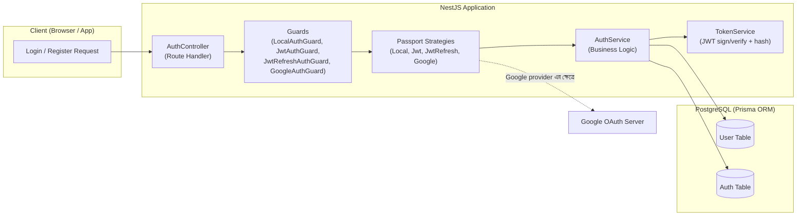
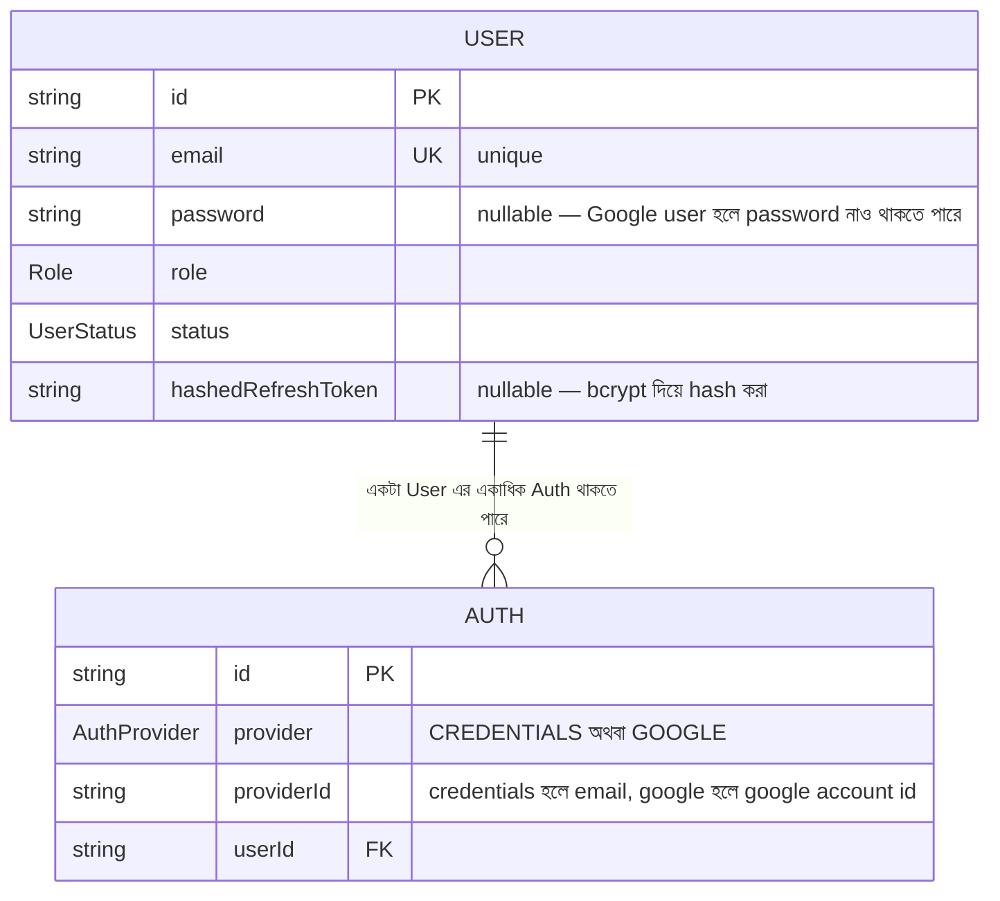
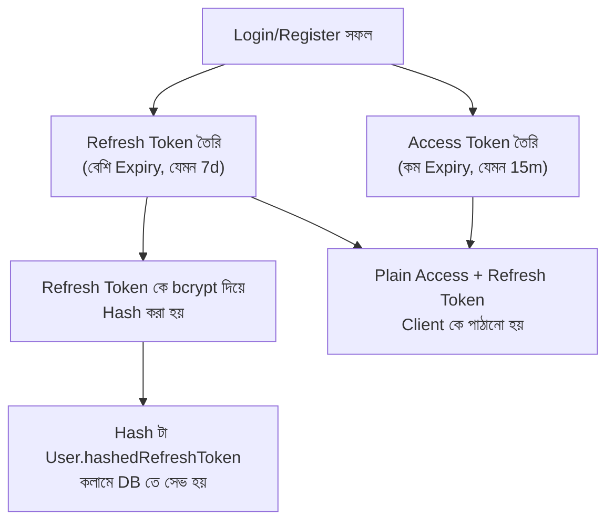
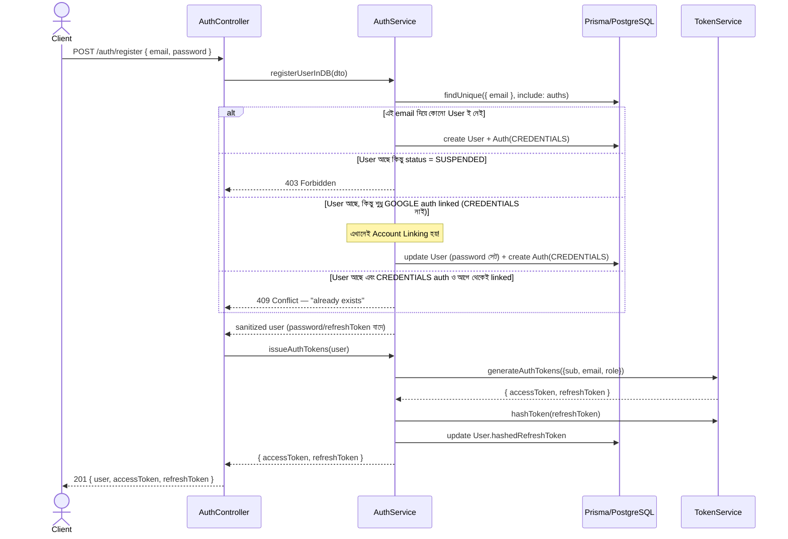
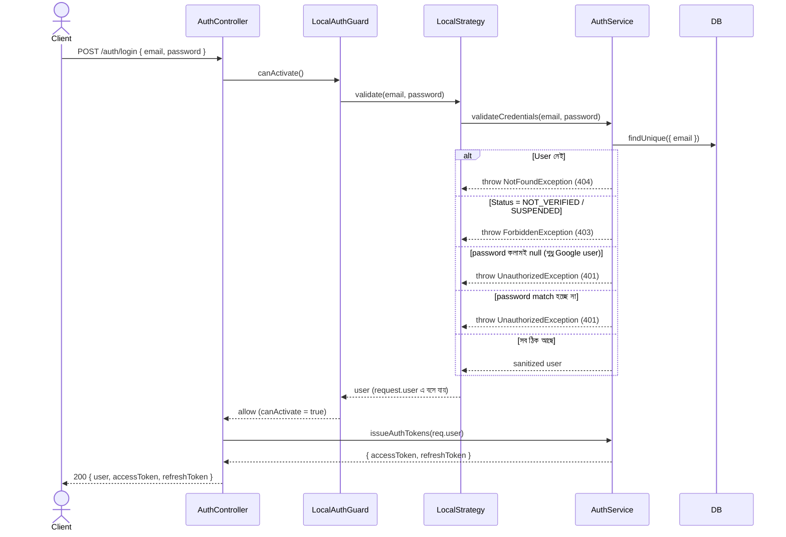
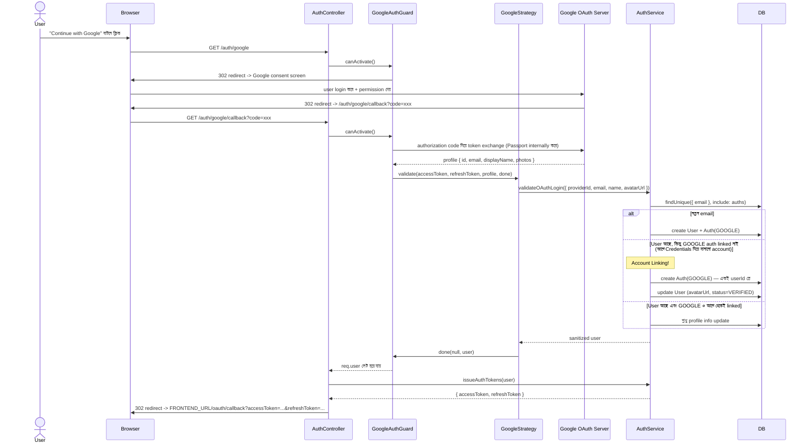
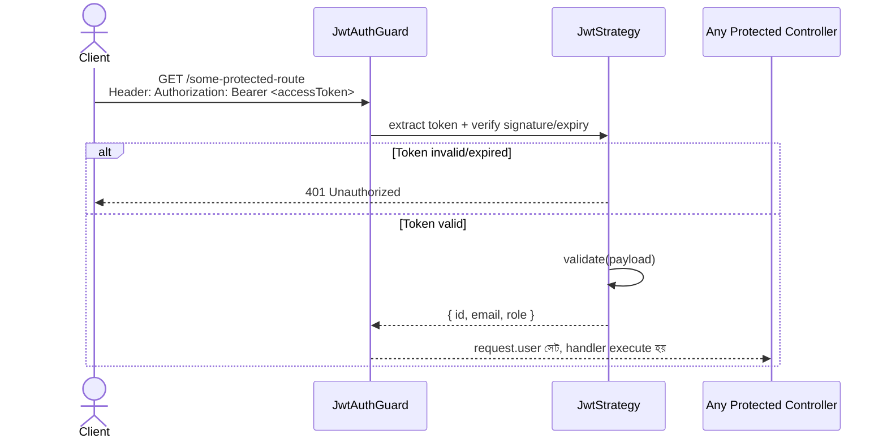
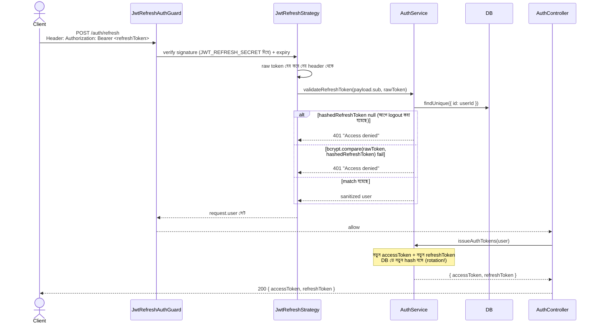
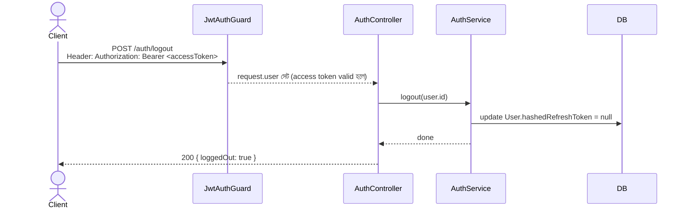

# Credentials + Google Login/Register — সম্পূর্ণ Authentication Flow (Interview Prep Guide)

এই ডকুমেন্টটা লেখা হয়েছে যাতে তুমি নিজের প্রজেক্টের Authentication সিস্টেমটা **নিজের মুখে, নিজের ভাষায়, deep understanding নিয়ে** explain করতে পারো — বিশেষ করে ইন্টারভিউতে। শুধু "কী করেছি" না, **"কেন এভাবে করেছি"** সেটাও প্রতিটা সেকশনে বলা আছে, কারণ ইন্টারভিউয়ার সবচেয়ে বেশি এই "কেন" প্রশ্নটাই করে।

---

## সূচিপত্র (Table of Contents)

1. [সমস্যাটা কী ছিল — Problem Statement](#১-সমস্যাটা-কী-ছিল--problem-statement)
2. [High-Level আর্কিটেকচার](#২-high-level-আর্কিটেকচার)
3. [ডেটাবেজ ডিজাইন — কেন দুইটা টেবিল (User + Auth)](#৩-ডেটাবেজ-ডিজাইন--কেন-দুইটা-টেবিল-user--auth)
4. [Passport.js Concepts — Strategy vs Guard](#৪-passportjs-concepts--strategy-vs-guard)
5. [JWT Access Token + Refresh Token থিওরি](#৫-jwt-access-token--refresh-token-থিওরি)
6. [ফোল্ডার স্ট্রাকচার ও প্রতিটা ফাইলের দায়িত্ব](#৬-ফোল্ডার-স্ট্রাকচার-ও-প্রতিটা-ফাইলের-দায়িত্ব)
7. [Flow ১: Credentials দিয়ে Register](#৭-flow-১-credentials-দিয়ে-register)
8. [Flow ২: Credentials দিয়ে Login](#৮-flow-২-credentials-দিয়ে-login)
9. [Flow ৩: Google দিয়ে Login/Register (Account Linking)](#৯-flow-৩-google-দিয়ে-loginregister-account-linking)
10. [Flow ৪: Protected Route Access (JWT Guard)](#১০-flow-৪-protected-route-access-jwt-guard)
11. [Flow ৫: Refresh Token দিয়ে নতুন Token নেওয়া (Rotation)](#১১-flow-৫-refresh-token-দিয়ে-নতুন-token-নেওয়া-rotation)
12. [Flow ৬: Logout (Token Revocation)](#১২-flow-৬-logout-token-revocation)
13. [Security Decisions — কেন এভাবে করলাম](#১৩-security-decisions--কেন-এভাবে-করলাম)
14. [যে বাগগুলো ফিক্স করা হয়েছে (Great Interview Story)](#১৪-যে-বাগগুলো-ফিক্স-করা-হয়েছে-great-interview-story)
15. [API Reference (Quick Table)](#১৫-api-reference-quick-table)
16. [Interview এ যা যা জিজ্ঞেস হতে পারে (Q&A)](#১৬-interview-এ-যা-যা-জিজ্ঞেস-হতে-পারে-qa)

---

## ১. সমস্যাটা কী ছিল — Problem Statement

আমার requirement ছিল ৪টা:

1. **দুই ধরনের Login সাপোর্ট করতে হবে** — Email/Password (Credentials) এবং Google OAuth2.0।
2. **Account Linking** — একজন ইউজার যদি প্রথমে Credentials দিয়ে account বানায়, পরে সে যেন একই email দিয়ে Google দিয়েও login করতে পারে (এবং উল্টোটাও)। মানে দুইটা আলাদা account তৈরি হবে না, একই User এর সাথে দুইটা login-method attach হবে।
3. **Access Token + Refresh Token** — Login/Register করলে দুইটা টোকেনই client কে পাঠাতে হবে।
4. **Token Refresh** — Access token expire হয়ে গেলে, refresh token দিয়ে নতুন access + refresh token pair বানিয়ে দিতে হবে (এটাকে বলে **Token Rotation**)।

আর implementation করতে হবে **Passport.js** দিয়ে, NestJS-এর সাথে industry-standard architecture মেনে।

---

## ২. High-Level আর্কিটেকচার



**মূল আইডিয়া:** Controller কখনও সরাসরি business logic লেখে না। Guard আগে request-টাকে filter করে (valid কিনা check করে), Strategy সেই validation-এর আসল কাজটা করে (Passport-এর নিয়মে), আর আসল DB operation গুলো থাকে Service লেয়ারে। এটাই **Separation of Concerns** — ইন্টারভিউতে এই টার্মটা বলবে।

---

## ৩. ডেটাবেজ ডিজাইন — কেন দুইটা টেবিল (User + Auth)



```prisma
// prisma/schema/user.prisma
model User {
  id                 String     @id @default(uuid())
  email              String     @unique
  password           String?
  role               Role       @default(USER)
  status             UserStatus @default(NOT_VERIFIED)
  hashedRefreshToken String?
  auths              Auth[]
  // ...
}

// prisma/schema/auth.prisma
model Auth {
  id         String       @id @default(uuid())
  provider   AuthProvider
  providerId String
  userId     String
  user       User         @relation(fields: [userId], references: [id], onDelete: Cascade)

  @@unique([provider, providerId])
  @@unique([userId, provider])
}
```

### কেন `password` টা `User` টেবিলে রাখলাম কিন্তু Login-method আলাদা টেবিলে?

এটাই এই ডিজাইনের সবচেয়ে গুরুত্বপূর্ণ decision, ইন্টারভিউতে অবশ্যই আসবে।

- যদি আমি `User.provider = 'GOOGLE' | 'CREDENTIALS'` — এভাবে একটামাত্র কলামে রাখতাম, তাহলে একজন ইউজার **একইসাথে দুইটা provider দিয়ে login করতে পারতো না**। কারণ একটা কলামে একটাই value থাকে।
- Account Linking করতে হলে দরকার **one-to-many** সম্পর্ক: এক User → একাধিক Auth method। তাই `Auth` কে আলাদা টেবিল করে `userId` দিয়ে `User`-এর সাথে সম্পর্ক তৈরি করেছি।
- `@@unique([provider, providerId])` — একটা constraint যেটা guarantee দেয় একই Google account (`providerId`) দিয়ে দুইটা আলাদা User তৈরি হতে পারবে না।
- `@@unique([userId, provider])` — একটা constraint যেটা guarantee দেয় একই User এর জন্য একই provider দুইবার add হবে না (যেমন, একই ইউজারের ২টা `GOOGLE` auth entry থাকতে পারবে না)।

---

## ৪. Passport.js Concepts — Strategy vs Guard

এই দুইটার পার্থক্য বুঝাটা খুবই গুরুত্বপূর্ণ, কারণ বেশিরভাগ মানুষ এই দুইটা গুলিয়ে ফেলে।

| | **Strategy** | **Guard** |
|---|---|---|
| কাজ | ভ্যালিডেশনের **আসল লজিক** — user আসলেই valid কিনা সেটা যাচাই করা | Route-এ **কখন** সেই strategy চালানো হবে সেটা ঠিক করা |
| উদাহরণ | `LocalStrategy.validate(email, password)` | `@UseGuards(LocalAuthGuard)` |
| তুলনা | একজন security guard-এর "checklist" | দরজায় দাঁড়ানো আসল guard |

```typescript
// src/modules/auth/guards/local-auth.guard.ts
import { Injectable } from '@nestjs/common';
import { AuthGuard } from '@nestjs/passport';

@Injectable()
export class LocalAuthGuard extends AuthGuard('local') {}
```

`AuthGuard('local')` একটা **mixin function** যেটা `@nestjs/passport` থেকে আসে — এটা `'local'` নামের strategy-টা খুঁজে বের করে, request থেকে email/password নিয়ে সেই strategy-র `validate()` মেথডে পাঠায়। Result সফল হলে `request.user`-এ বসিয়ে দেয়, ব্যর্থ হলে নিজে থেকেই `401 Unauthorized` throw করে।

এই প্রজেক্টে ৪টা Strategy আছে, প্রত্যেকটার নিজস্ব নাম (২য় constructor argument):

```typescript
LocalStrategy       -> 'local'        (default name, নাম না দিলে এটাই হয়)
JwtStrategy          -> 'jwt'
JwtRefreshStrategy    -> 'jwt-refresh'
GoogleStrategy        -> 'google'
```

এবং প্রত্যেকটার জন্য একটা করে Guard (`LocalAuthGuard`, `JwtAuthGuard`, `JwtRefreshAuthGuard`, `GoogleAuthGuard`) — এগুলো শুধু `AuthGuard('<name>')`-কে wrap করে, যাতে Controller-এ পরিষ্কারভাবে `@UseGuards(JwtAuthGuard)` লেখা যায়।

> **⚠️ একটা গুরুত্বপূর্ণ পয়েন্ট (আমি নিজে বাগ পেয়েছিলাম):**
> `PassportModule` কে শুধু import করলে হবে না, `PassportModule.register({ session: false })` দিয়ে register করতে হবে। `session: false` মানে হলো — আমরা session-based auth ব্যবহার করছি না (server কোনো session কুকি রাখবে না), পুরো সিস্টেমটা **stateless JWT-based**। এটা না করলে NestJS DI container `AuthGuard`-এর internal dependency (`AuthModuleOptions`) resolve করতে পারে না এবং app crash করে।

```typescript
// src/modules/auth/auth.module.ts
@Module({
  imports: [
    PassportModule.register({ session: false }), // 👈 এইটা must
    JwtModule.register({
      secret: config.jwt_access_secret,
      signOptions: { expiresIn: config.jwt_access_expires_in },
    }),
  ],
  // ...
})
export class AuthModule {}
```

---

## ৫. JWT Access Token + Refresh Token থিওরি



### কেন দুইটা আলাদা Token?

- **Access Token** — প্রতিটা protected API call-এর সাথে পাঠাতে হয় (`Authorization: Bearer <token>`)। এটার মেয়াদ **কম** রাখা হয় (যেমন ১৫ মিনিট), কারণ এটা যদি leak হয়েও যায়, বেশিক্ষণ misuse করা যাবে না।
- **Refresh Token** — শুধু নতুন Access Token নেওয়ার জন্য ব্যবহার হয়। মেয়াদ **বেশি** রাখা হয় (যেমন ৭ দিন), যাতে ইউজারকে বারবার login করতে না হয়।
- দুইটা আলাদা **secret** (`JWT_ACCESS_SECRET`, `JWT_REFRESH_SECRET`) ব্যবহার করা হয়েছে, যাতে একটা secret leak হলেও অন্যটা সুরক্ষিত থাকে।

### কেন Refresh Token টা DB-তে **hash** করে রাখা হয় (plain না)?

এটা ঠিক password hashing-এর মতো যুক্তি। যদি কোনোভাবে DB এর data leak হয়, attacker plain refresh token পেয়ে গেলে সরাসরি নতুন access token generate করে ফেলতে পারবে (কারণ refresh token নিজেই valid signature সহ আসল JWT)। কিন্তু hash রাখলে, leak হলেও attacker সেই hash থেকে আসল token বের করতে পারবে না।

```typescript
// src/modules/auth/token.service.ts
hashToken(token: string): Promise<string> {
  return bcrypt.hash(token, Number(config.bcrypt_salt_round) || 10);
}

compareToken(token: string, hashedToken: string): Promise<boolean> {
  return bcrypt.compare(token, hashedToken);
}
```

### Token Rotation কী?

প্রতিবার `/auth/refresh` কল করলে, শুধু নতুন Access Token না — নতুন **Refresh Token ও** বানিয়ে দেওয়া হয়, এবং পুরনোটা invalid করে দেওয়া হয় (DB তে নতুন hash বসিয়ে)। এতে কী লাভ?

- যদি একটা refresh token কোনোভাবে চুরি হয়ে যায়, এবং **legitimate user** পরে সেটা দিয়ে refresh করে, তখন DB-তে থাকা hash-টা আপডেট হয়ে যাবে — ফলে **চোরের কাছে থাকা পুরনো token** পরেরবার আর কাজ করবে না। (একে বলে *reuse detection*-এর প্রাথমিক ধাপ)।

---

## ৬. ফোল্ডার স্ট্রাকচার ও প্রতিটা ফাইলের দায়িত্ব

```text
src/modules/auth/
├── auth.controller.ts          # Route গুলো define করে, HTTP layer
├── auth.module.ts              # সব provider/strategy/guard wire করে
├── auth.service.ts             # আসল business logic (register/login/oauth/refresh/logout)
├── token.service.ts            # শুধু JWT sign করা + hash/compare করার দায়িত্ব
├── dto/
│   └── auth.dto.ts             # RegisterDto, LoginDto — input validation
├── interfaces/
│   ├── jwt-payload.interface.ts    # JWT payload এর shape
│   └── google-profile.interface.ts # Google profile থেকে normalize করা shape
├── strategies/
│   ├── local.strategy.ts       # Email/Password validate করে
│   ├── jwt.strategy.ts         # Access token verify করে
│   ├── jwt-refresh.strategy.ts # Refresh token verify করে + DB hash check
│   └── google.strategy.ts      # Google OAuth callback handle করে
├── guards/
│   ├── local-auth.guard.ts
│   ├── jwt-auth.guard.ts
│   ├── jwt-refresh-auth.guard.ts
│   └── google-auth.guard.ts
└── decorators/
    └── current-user.decorator.ts   # req.user কে সহজে inject করার জন্য @CurrentUser()
```

**কেন এভাবে ভাগ করলাম (Single Responsibility Principle):**

- `TokenService` কে `AuthService` থেকে আলাদা রেখেছি, কারণ Token বানানো/hash করা একটা **generic, reusable concern** — এটার সাথে "user register করা" বা "google থেকে user আনা"-র ব্যবসায়িক নিয়মের কোনো সম্পর্ক নেই।
- প্রতিটা Strategy তার নিজের একটামাত্র কাজ করে — validate করা। ডাটাবেজ query করার দায়িত্ব strategy-র না, `AuthService`-এর।
- DTO আলাদা রাখা হয়েছে `RegisterDto` (strong password লাগবে) ও `LoginDto` (শুধু presence check) — কারণ Register আর Login-এর validation rule একরকম না।

---

## ৭. Flow ১: Credentials দিয়ে Register



### Controller — খুব পাতলা (Thin Controller)

```typescript
@Post('register')
async register(@Body() registerDto: RegisterDto) {
  const user = await this.authService.registerUserInDB(registerDto);
  const tokens = await this.authService.issueAuthTokens(user);
  return { user, ...tokens };
}
```

`@Body() registerDto: RegisterDto` — এখানেই global `ValidationPipe` কাজ করে (main.ts এ configured), যা `class-validator` decorator (`@IsEmail`, `@IsStrongPassword`) অনুযায়ী validate করে দেয়, fail করলে Controller-এর কোড এক্সিকিউটই হয় না, সাথে সাথে `400 Bad Request` চলে যায়।

### Service — Account Linking Logic (সবচেয়ে গুরুত্বপূর্ণ অংশ)

```typescript
async registerUserInDB(registerDto: RegisterDto) {
  const { email, password } = registerDto;
  const existingUser = await this.prisma.user.findUnique({
    where: { email },
    include: { auths: true },
  });

  let linkToUserId: string | null = null;

  if (existingUser) {
    if (existingUser.status === UserStatus.SUSPENDED) {
      throw new ForbiddenException('User is suspended...');
    }

    const hasCredentials = existingUser.auths.some(
      (auth) => auth.provider === AuthProvider.CREDENTIALS,
    );

    if (hasCredentials) {
      throw new ConflictException('User with this email already exists');
    }

    // Account এ শুধু Google login আছে — এখন credentials যোগ করে দিচ্ছি
    linkToUserId = existingUser.id;
  }

  const hashedPassword = await bcrypt.hash(password, saltRounds);

  return linkToUserId
    ? this.prisma.user.update({
        where: { id: linkToUserId },
        data: {
          password: hashedPassword,
          status: UserStatus.VERIFIED,
          auths: { create: { provider: AuthProvider.CREDENTIALS, providerId: email } },
        },
      })
    : this.prisma.user.create({
        data: {
          email, password: hashedPassword, role: Role.USER, status: UserStatus.VERIFIED,
          auths: { create: { provider: AuthProvider.CREDENTIALS, providerId: email } },
        },
      });
}
```

**যা happen করছে ধাপে ধাপে:**

1. প্রথমে email দিয়ে User খোঁজা হয় — সাথে তার সব `auths` (relation) ও নিয়ে আসা হয়।
2. যদি User না থাকে → নতুন User + নতুন `Auth(CREDENTIALS)` তৈরি হয়। এটাই সাধারণ Register।
3. যদি User থাকে, কিন্তু আগে থেকে `CREDENTIALS` provider দিয়ে linked থাকে → মানে সে **আগে থেকেই password সেট করেছে**, তাই `409 Conflict` (duplicate registration আটকাচ্ছি)।
4. যদি User থাকে কিন্তু তার শুধু `GOOGLE` auth linked থাকে (আগে সে Google দিয়ে registered হয়েছিল, password ছিল না) → **এইখানেই আসল Account Linking ঘটে**: নতুন User তৈরি না করে, একই `User.id`-তে `password` বসিয়ে দেওয়া হয় এবং একটা নতুন `Auth(CREDENTIALS)` row যোগ হয়। ফলাফল: এখন সে email/password আর Google — দুইভাবেই login করতে পারবে, কিন্তু একটাই account।

---

## ৮. Flow ২: Credentials দিয়ে Login



### LocalStrategy — এক লাইনের কাজ

```typescript
@Injectable()
export class LocalStrategy extends PassportStrategy(Strategy) {
  constructor(private readonly authService: AuthService) {
    super({ usernameField: 'email' }); // default field 'username', তাই override করেছি
  }

  validate(email: string, password: string) {
    return this.authService.validateCredentials(email, password);
  }
}
```

**লক্ষ্য করো:** `passport-local` ডিফল্টভাবে `username`/`password` field আশা করে req.body-তে, কিন্তু আমাদের DTO তে `email` field আছে। তাই `super({ usernameField: 'email' })` দিয়ে বলে দিয়েছি request body-র কোন field-টা username হিসেবে ব্যবহার হবে।

### Controller-এ Guard ব্যবহার

```typescript
@UseGuards(LocalAuthGuard)
@HttpCode(HttpStatus.OK)
@Post('login')
async login(@CurrentUser() user: Express.User) {
  const tokens = await this.authService.issueAuthTokens(user);
  return { user, ...tokens };
}
```

লক্ষ্য করো — Controller-এ কোথাও `email`/`password` নিয়ে সরাসরি কাজ করা হয়নি! `@UseGuards(LocalAuthGuard)` আগেই সব validate করে ফেলেছে, এবং validated user-টা `@CurrentUser()` decorator দিয়ে সরাসরি পাওয়া যাচ্ছে।

### `@CurrentUser()` কীভাবে কাজ করে?

```typescript
export const CurrentUser = createParamDecorator(
  (_data: unknown, ctx: ExecutionContext) => {
    const request = ctx.switchToHttp().getRequest<Request>();
    return request.user; // Passport Strategy validate() থেকে যা return হয়েছিল, সেটাই এখানে থাকে
  },
);
```

এটা একটা custom **Param Decorator** — Nest-এর `createParamDecorator` API ব্যবহার করে বানানো, যা `ExecutionContext` থেকে raw HTTP request বের করে তার `user` property রিটার্ন করে (Passport নিজে থেকেই successful validation-এর পর `request.user` সেট করে দেয়)।

---

## ৯. Flow ৩: Google দিয়ে Login/Register (Account Linking)



### GoogleStrategy

```typescript
@Injectable()
export class GoogleStrategy extends PassportStrategy(Strategy, 'google') {
  constructor(private readonly authService: AuthService) {
    super({
      clientID: config.google_client_id,
      clientSecret: config.google_client_secret,
      callbackURL: config.google_callback_url,
      scope: ['email', 'profile'],
    });
  }

  async validate(_at: string, _rt: string, profile: Profile, done: VerifyCallback) {
    const email = profile.emails?.[0]?.value;
    if (!email) {
      return done(new UnauthorizedException('Google account has no accessible email'), false);
    }

    const user = await this.authService.validateOAuthLogin({
      providerId: profile.id,       // Google Account এর unique, permanent id
      email,
      name: profile.displayName,
      avatarUrl: profile.photos?.[0]?.value,
    });

    done(null, user); // এটাই request.user হয়ে যায়
  }
}
```

> **মজার ব্যাপার:** `passport-google-oauth20` স্ট্র্যাটেজির `validate()` মেথডের প্যারামিটার প্যাটার্নটা `LocalStrategy`-র মতো না — এখানে ৪টা প্যারামিটার (`accessToken`, `refreshToken` — **এগুলো Google-এর নিজস্ব OAuth token**, আমাদের JWT না!, `profile`, এবং `done` কলব্যাক)। `done(err, user)` কল করলেই Passport সেটাকে `request.user`-এ বসায়।

### AuthService.validateOAuthLogin() — সিমেট্রিক Account Linking

```typescript
async validateOAuthLogin(profile: GoogleProfile) {
  const { email, name, avatarUrl, providerId } = profile;
  const existingUser = await this.prisma.user.findUnique({
    where: { email },
    include: { auths: true },
  });

  if (existingUser) {
    if (existingUser.status === UserStatus.SUSPENDED) {
      throw new ForbiddenException('User is suspended...');
    }

    const hasGoogleAuth = existingUser.auths.some(
      (auth) => auth.provider === AuthProvider.GOOGLE,
    );

    if (!hasGoogleAuth) {
      // Credentials দিয়ে বানানো account-এর সাথে Google identity link করে দিচ্ছি
      await this.prisma.auth.create({
        data: { provider: AuthProvider.GOOGLE, providerId, userId: existingUser.id },
      });
    }

    return this.prisma.user.update({
      where: { id: existingUser.id },
      data: { name: existingUser.name ?? name, avatarUrlForGoogle: avatarUrl, status: UserStatus.VERIFIED },
    });
  }

  return this.prisma.user.create({
    data: {
      email, name, avatarUrlForGoogle: avatarUrl, role: Role.USER, status: UserStatus.VERIFIED,
      auths: { create: { provider: AuthProvider.GOOGLE, providerId } },
    },
  });
}
```

লক্ষ্য করো — এটা ঠিক `registerUserInDB`-এর **আয়না (mirror)**। `registerUserInDB` চেক করে `hasCredentials`, আর এখানে চেক করা হয় `hasGoogleAuth`। এভাবেই দুই দিক থেকেই (Credentials → Google, এবং Google → Credentials) account linking সিমেট্রিকভাবে কাজ করে।

**একটা পার্থক্য খেয়াল করো:** Credentials register-এ duplicate হলে `409 Conflict` throw করা হয় (কারণ password দিয়ে explicit signup একটা intentional action, duplicate হলে ইউজারকে জানানো দরকার)। কিন্তু Google login-এ যদি `hasGoogleAuth` আগে থেকেই true থাকে, কোনো error না দিয়ে চুপচাপ normal login হিসেবে treat করা হয় — কারণ Google login user নিজে থেকে "sign up" click করছে না, browser flow-ই এমন যে প্রতিবারই "/auth/google" hit হবে, সেটাকেই login হিসেবে ধরা স্বাভাবিক।

---

## ১০. Flow ৪: Protected Route Access (JWT Guard)



```typescript
// src/modules/auth/strategies/jwt.strategy.ts
@Injectable()
export class JwtStrategy extends PassportStrategy(Strategy, 'jwt') {
  constructor() {
    super({
      jwtFromRequest: ExtractJwt.fromAuthHeaderAsBearerToken(), // "Authorization: Bearer <token>" থেকে বের করে
      ignoreExpiration: false, // expire হলে reject করবে
      secretOrKey: config.jwt_access_secret,
    });
  }

  validate(payload: JwtPayload) {
    // এইখানে DB call করা হয়নি ইচ্ছাকৃতভাবে — কারণ JWT নিজেই self-contained/stateless
    return { id: payload.sub, email: payload.email, role: payload.role };
  }
}
```

**গুরুত্বপূর্ণ:** `JwtStrategy.validate()`-এ কোনো DB call নেই। কারণ JWT-র মূল সুবিধাই হলো এটা **stateless** — signature ভ্যালিড মানেই আমরা payload-কে বিশ্বাস করি, প্রতিবার DB hit করার দরকার নেই। এটাই Access Token-কে fast করে। (যদি user-কে সাথে সাথে block/suspend করার দরকার হতো real-time-এ, তখন হয়তো DB check যোগ করতে হতো — কিন্তু সেটা একটা trade-off, performance vs real-time-revocation)।

---

## ১১. Flow ৫: Refresh Token দিয়ে নতুন Token নেওয়া (Rotation)



### JwtRefreshStrategy — কেন `passReqToCallback: true`?

```typescript
@Injectable()
export class JwtRefreshStrategy extends PassportStrategy(Strategy, 'jwt-refresh') {
  constructor(private readonly authService: AuthService) {
    super({
      jwtFromRequest: ExtractJwt.fromAuthHeaderAsBearerToken(),
      ignoreExpiration: false,
      secretOrKey: config.jwt_refresh_secret,
      passReqToCallback: true, // 👈 এটার জন্যই validate(req, payload) — req access পাচ্ছি
    });
  }

  validate(req: Request, payload: JwtPayload) {
    const refreshToken = ExtractJwt.fromAuthHeaderAsBearerToken()(req);
    return this.authService.validateRefreshToken(payload.sub, refreshToken as string);
  }
}
```

Passport-jwt সাধারণত শুধু **decoded payload** পাঠায় `validate()`-এ, raw token স্ট্রিংটা পাঠায় না। কিন্তু refresh flow-এ আমাদের raw token-টাও লাগবে, কারণ সেটাকে DB-তে থাকা hash-এর সাথে `bcrypt.compare()` করতে হবে। তাই `passReqToCallback: true` দিয়ে পুরো `req` অবজেক্টটাই `validate()`-এ পাঠানো হয়েছে, যাতে সেখান থেকে আবার raw token বের করে নেওয়া যায়।

### AuthService — দুইটা লেয়ারের Verification

```typescript
async validateRefreshToken(userId: string, refreshToken: string) {
  const user = await this.prisma.user.findUnique({ where: { id: userId } });

  if (!user?.hashedRefreshToken) {
    throw new UnauthorizedException('Access denied');
  }

  const isMatching = await this.tokenService.compareToken(refreshToken, user.hashedRefreshToken);
  if (!isMatching) {
    throw new UnauthorizedException('Access denied');
  }

  const { password, hashedRefreshToken, ...sanitizedUser } = user;
  return sanitizedUser;
}
```

এখানে **দুই ধাপে verification** হচ্ছে:
1. **JWT signature/expiry check** — `JwtRefreshStrategy` এর constructor options দিয়ে Passport নিজে থেকেই করে দেয়।
2. **DB-তে stored hash-এর সাথে মিলিয়ে দেখা** — এটা extra layer, যেটার কারণেই **logout করলে refresh token সাথে সাথে অকেজো হয়ে যায়** — signature ভ্যালিড হলেও, DB তে hash না থাকলে (logout-এর পর `null` হয়ে যায়) reject হয়ে যাবে।

---

## ১২. Flow ৬: Logout (Token Revocation)



```typescript
async logout(userId: string) {
  await this.prisma.user.update({
    where: { id: userId },
    data: { hashedRefreshToken: null },
  });
}
```

**একটা গুরুত্বপূর্ণ observation (ইন্টারভিউতে বলার মতো একটা nuance):** Logout করার পর পুরনো **Access Token** কিন্তু তখনই invalid হয়ে যায় না — কারণ Access Token সম্পূর্ণ **stateless**, DB-তে কোনো blacklist/check নেই তার জন্য (Flow ৪ দেখো)। ওটা নিজে থেকেই তার মেয়াদ (যেমন ১৫ মিনিট) শেষ হলে কাজ করা বন্ধ করবে। কিন্তু **Refresh Token সাথে সাথে অকেজো** হয়ে যায়, কারণ DB-তে থাকা hash মুছে ফেলা হয়েছে — তাই attacker সেই refresh token দিয়ে নতুন access token বানাতে পারবে না। এটা একটা **conscious trade-off**: পুরোপুরি real-time access-token revocation করতে চাইলে প্রতিটা request-এ DB/Redis call লাগবে যেটা performance কমিয়ে দেয়।

---

## ১৩. Security Decisions — কেন এভাবে করলাম

| Decision | কেন |
|---|---|
| Password `bcrypt` দিয়ে hash | Plain text password DB তে রাখা কখনোই ঠিক না — leak হলে সব ইউজারের password চুরি হয়ে যাবে |
| Refresh Token ও `bcrypt` দিয়ে hash করে রাখা | একই যুক্তি — DB leak হলেও refresh token ব্যবহারযোগ্য থাকবে না |
| Access আর Refresh Token-এর জন্য আলাদা secret | একটা compromise হলে আরেকটা সুরক্ষিত থাকে; blast radius কমে |
| Access Token কম মেয়াদী, Refresh বেশি মেয়াদী | Leak হলে exposure window কম রাখা, কিন্তু UX ভালো রাখা (বারবার login না লাগা) |
| Refresh Token Rotation (প্রতিবার নতুন pair) | Token reuse detect/prevent করা সহজ হয় |
| `PassportModule.register({ session: false })` | পুরো auth system কে stateless রাখা — horizontally scale করা সহজ, কোনো sticky session লাগে না |
| `omit: { password: true, hashedRefreshToken: true }` সব Prisma query তে | Response এ কখনো ভুল করেও sensitive field leak না হয় |
| Strong Password Validation (`class-validator`) শুধু Register এ | Login এ শুধু presence check যথেষ্ট — strong-password rule নতুন করে চাপালে পুরনো valid user block হয়ে যেতে পারে |

---

## ১৪. যে বাগগুলো ফিক্স করা হয়েছে (Great Interview Story)

ইন্টারভিউতে প্রায়ই জিজ্ঞেস করে — *"একটা কঠিন বাগ শেয়ার করো যেটা তুমি ডিবাগ করেছো।"* — নিচের দুইটা answer হিসেবে খুব ভালো।

### বাগ ১: সব Exception `401`-এ পরিণত হয়ে যাচ্ছিল

**আগে যা ছিল:**
```typescript
try {
  // ... validation logic যেখানে NotFoundException, ForbiddenException throw হয়
} catch (error) {
  throw new UnauthorizedException('Failed to process login...'); // সব কিছু ধরে ফেলছে!
}
```
এখানে সমস্যা হলো — `try` ব্লকের ভিতরেই ইচ্ছাকৃতভাবে `NotFoundException` (404) বা `ForbiddenException` (403) throw করা হচ্ছিল, কিন্তু বাইরের `catch (error)` সেটাকেও ধরে ফেলে একটা generic `401` বানিয়ে ফেলছিল। ফলে client কখনোই আসল error status (404/403/409) পাচ্ছিল না — সব সময় `401` পেত, যেটা debugging এবং frontend-এর error handling দুইটাই কঠিন করে দেয়।

**Fix:**
```typescript
try {
  // ...
} catch (error) {
  if (error instanceof HttpException) {
    throw error; // ইচ্ছাকৃত/জানা exception হলে, সেটা যেভাবে আছে সেভাবেই re-throw করো
  }
  // শুধু unexpected/unknown error হলেই generic 500 দাও
  this.logger.error('...', getErrorDetails(error));
  throw new InternalServerErrorException('...');
}
```
**শিক্ষা:** `try/catch`-এ generic catch করার আগে সবসময় ভাবতে হবে — এই catch ব্লকটা কি **শুধু unexpected error** ধরার জন্য, নাকি **সব ধরনের error** এক করে ফেলছে। NestJS-এ `HttpException` (এবং তার সব subclass — `NotFoundException`, `ForbiddenException` ইত্যাদি) থেকে আসা error সবসময় "ইচ্ছাকৃত, already-handled" error, এগুলোকে re-throw করাই উচিত।

### বাগ ২: `LocalStrategy` ভুলভাবে `register` কল করছিল

**আগে:**
```typescript
async validate(email: string, password: string): Promise<any> {
  const user = await this.authService.registerUserInDB({ email, password }); // ❌ Login flow-এ Register কল হচ্ছে!
  // ...
}
```
`/auth/login` রুটে গেলে ভেতরে ভেতরে actual register (নতুন ইউজার তৈরির) লজিক রান হচ্ছিল — ভুল password দিলেও naive ভাবে হয়তো নতুন ডেটা তৈরি হয়ে যাচ্ছিল বা conflict দিত। এটা fix করে `validateCredentials()` নামে একটা আলাদা মেথড বানানো হয়েছে যেটা শুধু **check** করে, কিছু তৈরি করে না।

### বাগ ৩: `PrismaModule` মিসিং ছিল, পুরো অ্যাপ বুট হচ্ছিল না

`app.module.ts` তে `PrismaModule` import করা ছিল, কিন্তু আসল ফাইলটা (`src/prisma/prisma.module.ts`) delete হয়ে গিয়েছিল। ফলে পুরো অ্যাপ start-ই হতে পারছিল না। এটা recreate করা হয়েছে `@Global()` decorator দিয়ে, যাতে `PrismaService` পুরো app-এ যেকোনো module-এ (আলাদা করে import না করেও) inject করা যায়।

```typescript
@Global()
@Module({
  providers: [PrismaService],
  exports: [PrismaService],
})
export class PrismaModule {}
```

---

## ১৫. API Reference (Quick Table)

| Method | Route | Guard | Body | Response |
|---|---|---|---|---|
| `POST` | `/api/v1/auth/register` | — | `{ email, password }` | `201 { user, accessToken, refreshToken }` |
| `POST` | `/api/v1/auth/login` | `LocalAuthGuard` | `{ email, password }` | `200 { user, accessToken, refreshToken }` |
| `GET` | `/api/v1/auth/google` | `GoogleAuthGuard` | — | `302` redirect → Google consent screen |
| `GET` | `/api/v1/auth/google/callback` | `GoogleAuthGuard` | — (query থেকে `code` আসে) | `302` redirect → `FRONTEND_URL/oauth/callback?accessToken=...&refreshToken=...` |
| `POST` | `/api/v1/auth/refresh` | `JwtRefreshAuthGuard` | — (Header: `Authorization: Bearer <refreshToken>`) | `200 { accessToken, refreshToken }` |
| `POST` | `/api/v1/auth/logout` | `JwtAuthGuard` | — (Header: `Authorization: Bearer <accessToken>`) | `200 { loggedOut: true }` |

---

## ১৬. Interview এ যা যা জিজ্ঞেস হতে পারে (Q&A)

**Q: Access Token আর Refresh Token আলাদা কেন রাখলে, একটাই তো যথেষ্ট হতে পারতো?**
> একটা মাত্র দীর্ঘমেয়াদী token রাখলে সেটা leak হলে অনেকদিন ধরে misuse হতে পারবে। তাই short-lived Access Token (ঘন ঘন ব্যবহারের জন্য) আর long-lived Refresh Token (শুধু নতুন Access Token নেওয়ার জন্য, কম exposure) — এই split করাটাই industry standard, একে বলে "token pair pattern"।

**Q: Refresh Token DB তে কেন hash করে রাখলে, নাকি সরাসরি রাখলেই তো যাচাই করা সহজ হতো?**
> Password-এর মতোই — DB compromise হলে attacker যেন সরাসরি ব্যবহারযোগ্য token না পায়, সেজন্য bcrypt দিয়ে hash করে রাখা হয়েছে, ঠিক যেমন password রাখা হয়।

**Q: Access token stateless রাখলে, কাউকে instant ban করতে চাইলে কী করবে?**
> এটা একটা known trade-off। সমাধান হতে পারে — একটা short TTL blacklist (Redis-এ) রাখা ব্যানড user id-দের জন্য, অথবা Access Token-এর TTL আরও ছোট রাখা (যেমন ৫ মিনিট) যাতে ban দ্রুত effective হয়।

**Q: Account Linking-এর সময় কীভাবে নিশ্চিত হচ্ছো যে একটা Google account দিয়ে অন্য কারো account হাইজ্যাক করা যাবে না?**
> Google নিজেই ইমেইল verify করে OAuth এর মাধ্যমে (`email_verified` ফ্ল্যাগ থাকে profile-এ) — মানে Google বলছে এই ইমেইলের প্রকৃত মালিক এই ব্যক্তি। তাই একই email হলে একই ব্যক্তি ধরে নেওয়া নিরাপদ। (ভবিষ্যতে আরও strict করতে চাইলে `profile.emails[0].verified === true` explicitly চেক করে নেওয়া যায়।)

**Q: `JwtStrategy.validate()`-এ DB call নেই কেন, এটা কি সমস্যা না?**
> এটা ইচ্ছাকৃত ডিজাইন — JWT-র মূল সুবিধাই stateless verification। DB call বাদ দেওয়াতে প্রতিটা authenticated request দ্রুত হয়। Trade-off হলো, ইউজারকে সাথে সাথে suspend করলে তার existing (এখনো valid) Access Token চলতে থাকবে যতক্ষণ না সেটার মেয়াদ শেষ হয়।

**Q: Guard আর Strategy একসাথে কেন লাগে, একটাতেই তো কাজ হতে পারতো?**
> Separation of concerns — Guard route-level decision নেয় (কোন strategy কোথায় apply হবে), Strategy করে আসল authentication logic। এতে একটা Strategy একাধিক জায়গায় reuse করা সহজ হয়, এবং কোড টেস্ট করাও সহজ হয় (strategy আলাদাভাবে unit-test করা যায়)।

**Q: কেন Google callback এ redirect ব্যবহার করলে, JSON response কেন দিলে না?**
> কারণ OAuth flow browser-driven — ইউজার browser-এ Google-এর consent screen-এ যায়, তারপর browser-ই callback URL এ ফিরে আসে (এটা কোনো AJAX/fetch call না, এটা একটা full page navigation)। তাই backend থেকে JSON রেসপন্স দিলে সেটা user সরাসরি browser-এ raw JSON হিসেবে দেখবে, frontend app সেটা handle করতে পারবে না। তাই frontend-এর একটা নির্দিষ্ট route এ token গুলো নিয়ে redirect করে দেওয়া হয়, frontend সেখান থেকে token গুলো read করে (query params থেকে) localStorage/cookie-তে সেভ করে নেয়।

---

### শেষ কথা

এই পুরো সিস্টেমটার মূল দর্শন হলো:

> **"Controller শুধু traffic-directcontrol করে, Guard filter করে, Strategy validate করে, Service business decision নেয়, আর TokenService শুধু crypto নিয়ে কাজ করে।"**

এই layered architecture-টাই ইন্টারভিউতে সবচেয়ে ভালোভাবে বিক্রি করার জিনিস — কারণ এটা দেখায় তুমি শুধু "কাজ চালানো" কোড লেখোনি, বরং **maintainable, testable, industry-standard** কোড লিখেছো।
